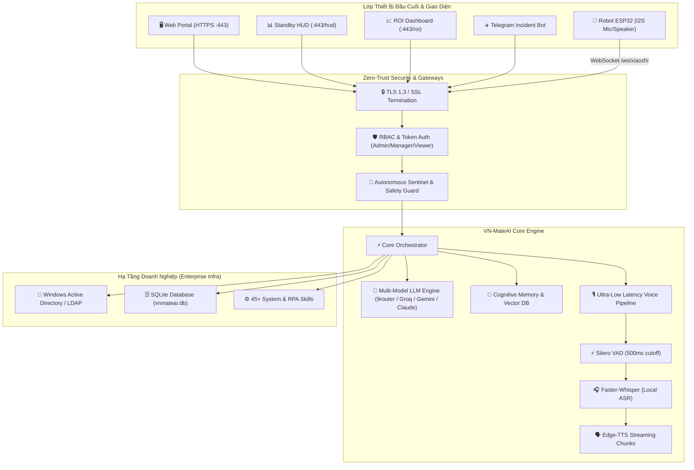

<div align="center">

# 🤖 VN-MateAI: Enterprise AIOps & Desktop Robot
### Trợ Lý Vận Hành CNTT & Robot Thông Minh Đa Phương Thức

[](https://python.org)
[](https://fastapi.tiangolo.com)
[](https://websockets.readthedocs.io/)
[](#bảo-mật-zero-trust--autonomous-sentinel)
[](#robot-để-bàn-esp32--giao-thức-xiaozhi)
[](#luồng-thoại-siêu-tốc-ultra-low-latency)

</div>

---

## 📖 Giới Thiệu (Overview)

**VN-MateAI** là nền tảng Trợ lý AI Điều hành CNTT Doanh nghiệp (Enterprise AIOps) kết hợp điều khiển Robot để bàn (ESP32 Smart Companion). Hệ thống được thiết kế với độ trễ phản hồi đàm thoại siêu tốc (< 200ms), cơ chế bảo mật **Zero-Trust**, hỗ trợ đồng bộ dữ liệu **Active Directory/LDAP**, quản lý sự cố thời gian thực qua **Telegram Gateway**, và hơn 45+ kỹ năng tự động hóa (Automation Skills).

---

## 🏛️ Kiến Trúc Hệ Thống (System Architecture)



---

## ✨ Tính Năng Nổi Bật (Key Features)

### 1. 🎙️ Luồng Thoại Siêu Tốc (Ultra-Low Latency Pipeline)
- **Silero VAD (Voice Activity Detection)**: Cắt ngắn câu nói chính xác ngay sau 500ms khoảng lặng, loại bỏ độ trễ chờ đợi.
- **Faster-Whisper In-Memory ASR**: Xử lý giọng nói thành văn bản trực tiếp từ RAM (`numpy.float32`), loại bỏ hoàn toàn việc đọc/ghi file WAV ra ổ cứng (đo lường ~90ms).
- **Edge-TTS Chunk Streaming**: Phát âm thanh câu đầu tiên ngay khi LLM vừa sinh xong dấu câu đầu tiên (First-chunk Latency < 200ms).

### 2. 🛡️ Bảo Mật Zero-Trust & Autonomous Sentinel
- **Kiểm soát câu lệnh nguy hiểm**: Tự động phát hiện và chặn các câu lệnh nguy hại (`rmdir /s`, `format c:`, `drop database`, `kill_process`...) trừ khi được người dùng phê duyệt xác nhận qua Modal bảo mật.
- **Che giấu dữ liệu nhạy cảm (Data Masking)**: Tự động lọc API Key, mật khẩu, JWT Token, và IP nội bộ trước khi ghi log hoặc gửi ra ngoài.
- **Phân quyền RBAC**: 3 cấp độ: `admin`, `manager`, `viewer` bảo vệ toàn bộ REST API và WebSocket endpoints.

### 3. 🤖 Robot Để Bàn ESP32 & Giao Thức Xiaozhi
- Firmware C++ chuẩn cho vi điều khiển **ESP32-S3**.
- Giao tiếp âm thanh 2 chiều qua **I2S Microphone (INMP441)** và **I2S DAC/Amp (MAX98357A)**.
- Kết nối mã hóa WebSocket WSS trực tiếp đến máy chủ VN-MateAI.

### 4. 🧠 Trí Nhớ Nhận Thức (Cognitive Memory)
- Bộ nhớ vector cục bộ kết hợp SQLite, lưu trữ ngữ cảnh hội thoại dài hạn và lịch sử thực thi tác vụ của người dùng.
- Tự động trích xuất thông tin người dùng và tổng hợp bối cảnh thông minh.

### 5. 📊 Bộ Dashboard Giám Sát Đa Màn Hình
- **Web Portal (`/`)**: Trung tâm điều hành toàn diện, trò chuyện bằng giọng nói/văn bản, quản lý tiến trình, Active Directory, và kho kỹ năng.
- **Standby HUD (`/hud`)**: Màn hình Ambient HUD phong cách khoa học viễn tưởng hiển thị trạng thái phần cứng (CPU, RAM, NVMe), lưu lượng mạng, và biểu đồ trực quan 60FPS.
- **ROI Dashboard (`/roi`)**: Đo lường giá trị kinh tế thực tế, thời gian kỹ sư tiết kiệm được, số sự cố tự động khắc phục và tổng chi phí tối ưu.

### 6. ✈️ Telegram Incident & Remote Operations Gateway
- Nhận diện và cảnh báo sự cố máy chủ, dịch vụ gián đoạn theo thời gian thực tới nhóm Admin Telegram.
- Hỗ trợ ra lệnh từ xa bằng cú pháp `/exec`, `/status`, `/kpi`, `/alert`.

### 7. 🏢 Tích Hợp Active Directory & LDAP
- Đồng bộ danh bạ nhân sự, phòng ban, và danh sách máy trạm từ Domain Controller Windows Server.
- Tra cứu nhanh thông tin nhân viên bằng khẩu lệnh tiếng Việt.

---

## 🚀 Hướng Dẫn Cài Đặt Nhanh (Quick Start)

### Yêu Cầu Hệ Thống (Prerequisites)
- **Hệ điều hành**: macOS (Apple Silicon / Intel), Linux (Ubuntu 22.04+), hoặc Windows 10/11 64-bit.
- **Python**: Phiên bản `3.10` hoặc `3.11`.
- **Phần cứng khuyến nghị**: Tối thiểu 8GB RAM, CPU 4 cores trở lên.

---

### Bước 1: Tải Mã Nguồn (Clone Repository)
```bash
git clone https://github.com/lichpppp5/VN-MateAi.git
cd VN-MateAi
```

---

### Bước 2: Khởi Tạo Môi Trường Cục Bộ (Run Setup Script)

**Trên macOS / Linux:**
```bash
chmod +x setup.sh
./setup.sh
```

**Trên Windows (Command Prompt / PowerShell):**
```cmd
setup.bat
```

> **Setup Script sẽ tự động:**
> 1. Tạo các thư mục dữ liệu cục bộ: `storage/`, `data/`, `certs/`, `models/`, `logs/`.
> 2. Sao chép file cấu hình `config.example.json` thành `config.json`.
> 3. Tự động sinh chứng chỉ SSL tự ký cho kết nối HTTPS/WSS localhost.

---

### Bước 3: Cài Đặt Thư Viện Phụ Thuộc (Install Dependencies)

Khuyến nghị sử dụng môi trường ảo (Virtual Environment):
```bash
# Tạo môi trường ảo
python3 -m venv venv

# Kích hoạt môi trường ảo:
# macOS / Linux:
source venv/bin/activate
# Windows:
venv\Scripts\activate

# Cài đặt toàn bộ dependencies
pip install -r requirements.txt
```

---

### Bước 4: Điền Cấu Hình API Key (`config.json`)

Mở file `config.json` và cấu hình các trường cơ bản:
```json
{
  "llm": {
    "base_url": "http://localhost:20128/v1",
    "model_name": "ag/claude-sonnet-4-6",
    "api_key": "YOUR_9ROUTER_KEY_HERE"
  },
  "ASR_BACKEND": "local_whisper",
  "telegram": {
    "enabled": false,
    "bot_token": "YOUR_TELEGRAM_BOT_TOKEN",
    "admin_chat_ids": ["YOUR_TELEGRAM_ADMIN_CHAT_ID"]
  }
}
```

---

### Bước 5: Khởi Chạy Hệ Thống (Launch VN-MateAI)

```bash
python3 main.py
```

Sau khi khởi chạy thành công, mở trình duyệt và truy cập các liên kết sau:
- **Trung tâm điều hành (Web Portal):** [https://localhost](https://localhost)
- **Màn hình HUD chuyên dụng:** [https://localhost/hud](https://localhost/hud)
- **Báo cáo kinh tế (ROI Dashboard):** [https://localhost/roi](https://localhost/roi)

*(Do dùng chứng chỉ SSL tự ký trên máy phát triển, hãy chọn "Nâng cao" -> "Tiếp tục truy cập localhost" trên trình duyệt).*

---

## 🔑 Tài Khoản Mặc Định (Default Credentials)

Khi bảng `users` (trong `vnmateai.db`) còn rỗng — lần khởi động đầu với CSDL mới — hệ thống tạo 3 tài khoản mẫu:

| Tên Đăng Nhập | Mật Khẩu Mặc Định | Vai Trò (Role) | Quyền Hạn |
| :--- | :--- | :--- | :--- |
| `admin` | `admin123` | **admin** | Toàn quyền quản trị hệ thống, phê duyệt bảo mật, cấu hình |
| `manager` | `manager123` | **manager** | Điều hành tác vụ, giám sát báo cáo và quản lý sự cố |
| `viewer` | `viewer123` | **viewer** | Chỉ xem thông tin giám sát và bảng điều khiển |

> ⚠️ **Cảnh báo bảo mật.** Ba mật khẩu trên là mật khẩu mặc định yếu, chỉ dùng cho
> môi trường phát triển cục bộ. Trước khi triển khai thật, hãy đặt các biến môi
> trường sau **trước lần khởi động đầu tiên** (chỉ có tác dụng khi bảng `users`
> còn rỗng):
>
> ```bash
> export VNMATEAI_DEFAULT_ADMIN_PASSWORD='mat-khau-nam-manh'
> export VNMATEAI_DEFAULT_MANAGER_PASSWORD='...'
> export VNMATEAI_DEFAULT_VIEWER_PASSWORD='...'
> ```
>
> Khi bảng `users` đã có tài khoản, các biến trên không có tác dụng — hãy đổi mật
> khẩu qua giao diện quản trị. Tài khoản lưu duy nhất trong bảng `users` (hash
> bcrypt); `users.json` của bản cũ chỉ được di trú một lần rồi không còn dùng.

---

### Bước 4b. Cấu Hình Secret Bằng Biến Môi Trường (Khuyến Nghị)

Ngoài `config.json`, các bí mật có thể nạp qua biến môi trường — biến môi trường
**luôn thắng** giá trị trong file. Cách này giữ secret ngoài mã nguồn:

| Biến môi trường | Dùng cho |
| :--- | :--- |
| `VNMATEAI_JWT_SECRET` | Khóa ký JWT. Nếu không đặt, hệ thống tự sinh khóa ngẫu nhiên và lưu ở `certs/jwt_secret.key` (quyền `0600`). |
| `VNMATEAI_LLM_API_KEY` | API key của LLM provider (9Router). |
| `VNMATEAI_TELEGRAM_BOT_TOKEN` | Token bot Telegram. |
| `GROQ_API_KEY` | API key Groq (dự phòng cho STT). |
| `VNMATEAI_CORS_ORIGINS` | Danh sách origin được phép gọi chéo, phân tách bằng dấu phẩy. Mặc định rỗng = cùng origin. |
| `VNMATEAI_DEFAULT_ADMIN_PASSWORD` | Mật khẩu tài khoản `admin` khi bảng `users` còn rỗng. |
| `VNMATEAI_DEFAULT_MANAGER_PASSWORD` | Mật khẩu tài khoản `manager`. |
| `VNMATEAI_DEFAULT_VIEWER_PASSWORD` | Mật khẩu tài khoản `viewer`. |

> Lưu ý: các biến mật khẩu mặc định chỉ có tác dụng **ở lần khởi tạo đầu tiên**
> (bảng `users` rỗng). Sau đó hãy đổi mật khẩu qua giao diện quản trị.

---

### Bước 4c. Cấu Hình Firmware ESP32 (Nếu Dùng Robot)

Thông tin đăng nhập WiFi và device token **không** được commit vào git:

```bash
# 1. Tạo file secrets.h cục bộ
cp esp32_firmware/secrets.example.h esp32_firmware/src/secrets.h

# 2. Khởi động VN-MateAI một lần để sinh secret, rồi lấy device token
cat certs/device_secret.key
```

Điền `DEFAULT_WIFI_SSID`, `DEFAULT_WIFI_PASS` và `DEFAULT_DEVICE_TOKEN` vào
`secrets.h`, build và flash. File `secrets.h` đã được `.gitignore`.

Device token cho phép thiết bị stream âm thanh vào máy chủ; thiếu hoặc sai token
thì máy chủ từ chối kết nối (HTTP 403) — không có ngoại lệ cho mạng LAN. Thiết bị
kết nối cổng 8000 (WS không TLS); cổng này chỉ phục vụ đường của thiết bị.

---

## 🔒 Mô Hình Bảo Mật (Security Model)

> Tài liệu triển khai/vận hành đầy đủ: [`docs/production/`](docs/production/README.md).

Hệ thống áp dụng nguyên tắc **Zero-Trust — không tin cậy mặc định**:

### Xác thực
- Mọi endpoint HTTP dưới `/api/v1/` và `/api/erp/` đều bắt buộc có JWT hợp lệ.
  Không có ngoại lệ theo IP loopback, `Referer`, hay user-agent.
- Ba cổng WebSocket cũng yêu cầu xác thực:
  - `/ws/client` — worker LAN, dùng **enrollment secret** phát khi tải agent.
  - `/api/v1/xiaozhi/ws` và `/ws/audio-stream` — thiết bị ESP32, dùng
    **device enrollment secret** (`certs/device_secret.key`).
  - `/ws/hud` và `/ws/portal-ui` — dùng JWT của người dùng.
- Enrollment secret tách riêng cho worker và thiết bị: worker được phép nhận
  lệnh thực thi skill, thiết bị chỉ được stream âm thanh.

### Phân quyền (RBAC)
- `mateai/application/security/security_guard.py` là cổng kiểm tra duy nhất, dùng chung cho cả luồng
  chat/LLM và REST API.
- **Fail-closed**: danh tính không tra cứu được, id rỗng, role lạ trong DB, hoặc
  lỗi truy vấn → tất cả nhận role `viewer` (chỉ đọc). Không bao giờ tự nâng quyền.
- Role: `admin` > `it_support` > `operator` > `viewer`. Ba role cuối được giới hạn
  theo danh sách tool cho phép.
- Danh tính có trong CSDL luôn dùng role trong CSDL. Id kênh do **server** gán
  (`telegram:…`, thiết bị `esp32*`/`xiaozhi*`, HUD) nhận `admin` theo tiền tố —
  chỉ an toàn vì mọi kênh đó đều phải xác thực trước (xem
  `docs/production/security.md` §2, §6).

### Thực thi mã
- `auto_execute` mặc định là `false`. Chỉ khi được bật tường minh, mã do AI tự
  sinh mới chạy không cần duyệt. Trên nền tảng không có GUI, hệ thống **từ chối**
  thay vì tự duyệt.
- Một số tool bị cấm vĩnh viễn (`format_drive`, `wipe_all_data`) kể cả với admin.

### Xử lý secret
- `config.json`, `certs/`, `*.key`, `*.pem`, `secrets.h` đều bị `.gitignore`.
- Access log của uvicorn được lọc để thay mọi tham số nhạy cảm trong query string
  (`token`, `access_token`, `api_key`, `password`, `secret`) bằng `[REDACTED]`.
- Web portal và HUD được phục vụ từ chính máy chủ nên request là same-origin;
  CORS mặc định không mở origin nào và không gửi credential.

---

## 📂 Cấu Trúc Dự Án (Repository Structure)

```text
VN-MateAi/
├── core/
│   └── plugin_manager.py       # API plugin công khai: `from core.plugin_manager import export_skill`
├── src/mateai/                 # Mã nguồn chính (gói `mateai`, cài bằng `pip install -e .`)
│   ├── config/loader.py        # Cấu hình (cổng duy nhất vào config.json) + thư mục gốc dự án
│   ├── domain/                 # Thực thể nghiệp vụ
│   ├── application/            # Use case: voice, agent (LLM + cổng tool), skills, security,
│   │                           #   conversation, knowledge (RAG), analytics, operations, devices
│   ├── infrastructure/         # LLM provider, TTS/STT, CSDL, connectors, cache, TLS, file
│   └── interfaces/
│       ├── http/server.py      # Dựng app: CORS, middleware xác thực, mount tĩnh, probe, startup
│       ├── http/routers/       # 30 router theo nhóm (security, enterprise, voice, websockets, ...)
│       ├── http/*.py           # Dùng chung: ws_auth, hud_voice, speech, enrollment,
│       │                       #   secret_masking, log_stream
│       └── websocket/, telegram/, email/, desktop/
├── esp32_firmware/             # Mã nguồn C++ cho Robot để bàn ESP32
│   └── vnmate_robot/           # Firmware điều khiển phần cứng & âm thanh I2S
├── skills/                     # Skill được nạp động (shim + skill người dùng)
├── web/                        # Giao diện Web hiện đại (HTML5, Vanilla CSS, JS)
│   ├── index.html              # Web Portal chính
│   ├── hud.html                # Standby Ambient HUD chuyên dụng
│   ├── roi.html                # Enterprise ROI Dashboard
│   └── ...                     # JS Modules, Icons, Shaders
├── config.example.json         # File mẫu cấu hình hệ thống
├── setup.sh                    # Script khởi tạo cho macOS & Linux
├── setup.bat                   # Script khởi tạo cho Windows
├── requirements.txt            # Danh sách thư viện Python
├── main.py                     # Điểm khởi chạy ứng dụng chính
├── .gitignore                  # Bộ quy tắc loại trừ Git chuẩn Enterprise
└── README.md                   # Tài liệu hướng dẫn dự án
```

---

## 📜 Giấy Phép & Bản Quyền (License)

Dự án được phát triển và phát hành dưới giấy phép **MIT License**. Mọi đóng góp (Contributions) và báo cáo lỗi (Issues) đều được hoan nghênh tại [GitHub Repository](https://github.com/lichpppp5/VN-MateAi).
