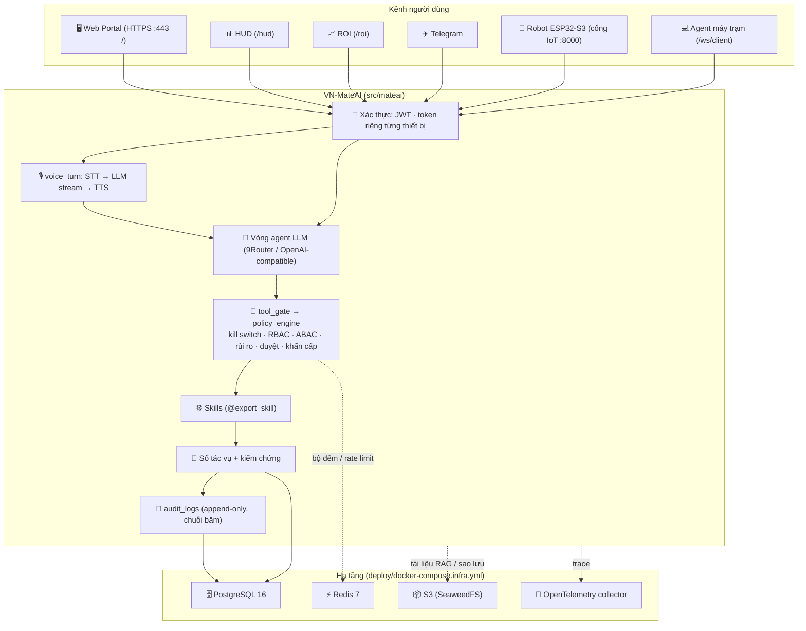

<div align="center">

# 🤖 VN-MateAI
### Trợ lý AI vận hành doanh nghiệp + robot Trợ Lý

[](https://python.org)
[](https://fastapi.tiangolo.com)
[](#-dữ-liệu-và-hạ-tầng)
[](#-robot-esp32)

</div>

---

## 📖 Giới thiệu

**VN-MateAI** là trợ lý AI cho bộ phận vận hành CNTT và điều hành doanh nghiệp. Người dùng có thể nói chuyện với nó qua Web Portal, màn hình HUD, Telegram hoặc robot để bàn ESP32. Nó dùng LLM để hiểu yêu cầu và gọi các công cụ (skill) để làm việc thật: kiểm tra máy chủ, tra ERP, gửi cảnh báo, điều khiển máy trạm.

Mọi hành động của AI đều đi qua **một cổng duy nhất**:

1. kiểm tra phân quyền (RBAC + ABAC) và mức rủi ro;
2. khi cần thì chờ người duyệt;
3. sau khi chạy thì kiểm chứng kết quả;
4. cuối cùng ghi vào nhật ký audit chỉ-ghi-thêm, có chuỗi băm.

Một chương trình, một tiến trình Python. Dữ liệu nằm ở **PostgreSQL**. Trạng thái dùng chung nằm ở **Redis**. Tệp và bản sao lưu nằm ở **S3**.

> Bản đồ hệ thống chi tiết (có số liệu kiểm chứng): [`docs/architecture/current-system-map.md`](docs/architecture/current-system-map.md).
> Triển khai và vận hành: [`docs/production/`](docs/production/README.md).

---

## 🏛️ Kiến trúc



---

## ✨ Tính năng

### 🎙️ Thoại
- Một đường xử lý cho cả 5 kênh: portal, HUD, robot, Telegram và REST. Âm thanh vào được nhận dạng bằng **faster-whisper** chạy cục bộ, có **Silero VAD** để cắt câu. Groq là phương án dự phòng.
- LLM trả lời dạng stream và được tách theo từng câu. Câu nào xong thì đọc ngay câu đó bằng **Edge-TTS** (mặc định, có thể dùng ElevenLabs). Âm thanh gửi về dạng khung nhị phân, qua jitter buffer 50–250 ms.
- Có câu xác nhận dựng sẵn để phản hồi ngay, không phải chờ LLM. Hỗ trợ ngắt lời (barge-in): lệnh mới sẽ huỷ lượt đang nói.
- Robot nhận diện từ đánh thức (wake word) trên máy chủ.

### 🛡️ An toàn và quản trị AI
- `policy_engine.authorize` xét các lớp theo thứ tự: kill switch → tool cấm → RBAC → ABAC (phòng ban + cấp bảo mật) → mức rủi ro.
  - Mức L0–L2 tự chạy.
  - Mức L3 phải chờ người duyệt.
  - Mức L4 được uỷ quyền trong thời hạn giới hạn.
  - Khi AI thao tác dồn dập, hệ thống tự chuyển sang **chế độ khẩn cấp**: chỉ cho đọc.
- Vòng agent có giới hạn số vòng lặp, số lần gọi tool, thời gian chạy và số lần tool lỗi liên tiếp. Vượt giới hạn thì dừng và chuyển cho người xử lý.
- Danh tính lấy từ CSDL hoặc từ token đã xác thực. **Tên hay tiền tố id không bao giờ cho thêm quyền.** Danh tính không xác định được thì chỉ được quyền thấp nhất (fail-closed).
- Nhật ký `audit_logs` chỉ-ghi-thêm. Mỗi dòng mang `prev_hash` và `row_hash`, và trigger trong DB chặn mọi lệnh UPDATE/DELETE. Admin kiểm tra tính toàn vẹn bằng `GET /api/v1/security/audit-logs/verify`.
- Bí mật trong `config.json` được mã hoá trên đĩa (`secret_box`). Log có cấu trúc và tự che bí mật.

### 📊 Giao diện
- **Web Portal (`/`)**: trò chuyện bằng giọng nói và văn bản, hàng chờ duyệt, quản lý người dùng và thiết bị, cấu hình (có lịch sử phiên bản), ERP, kho skill.
- **HUD (`/hud`)**: màn hình trực ban hiển thị telemetry, lệnh thoại và duyệt nhanh (chỉ admin). Muốn dùng giọng nói trên HUD thì phải đăng nhập.
- **ROI (`/roi`)**: số liệu giá trị lấy từ dữ liệu thật, không có số mẫu.

### 🔌 Tích hợp
- **Telegram**: gửi cảnh báo sự cố cho danh sách chat admin trong `telegram.admin_chat_ids`; nhận lệnh `/start`, `/status` và trò chuyện bằng văn bản.
- **Active Directory / LDAP**: đồng bộ nhân sự, phòng ban và máy trạm.
- **RAG**: tài liệu tải lên được lưu bền ở object storage.
- **Agent máy trạm** (`client_agent/`) và worker từ xa (`workers/`).

---

## 🗄️ Dữ liệu và hạ tầng

| Thành phần | Vai trò | Ghi chú |
|---|---|---|
| **PostgreSQL 16** | Nguồn sự thật | Bật bằng `DATABASE_URL` (trong `config.json`, tự mã hoá) hoặc biến `VNMATEAI_DATABASE_URL`. Schema `vnmate` (nghiệp vụ) và `hr` (danh bạ). |
| SQLite (`vnmateai.db`, `hr_kpi.db`) | Chế độ dev / đường lùi | Dùng khi không đặt `DATABASE_URL`. Cùng một mã nguồn: lớp `pg_compat` dịch SQL tại điểm mở duy nhất `open_sqlite`. |
| **Redis 7** | Trạng thái ngắn hạn dùng chung | Rate limit, khoá đăng nhập, bộ đếm khẩn cấp. Không có Redis → dùng RAM. |
| **S3** | Tài liệu RAG, bản sao lưu | `object_storage` trong `config.json`. Không cấu hình → thư mục cục bộ. |
| OpenTelemetry | Trace HTTP / thoại / tool / LLM | `VNMATEAI_OTEL_EXPORTER=none / console / otlp`. |

---

## 🚀 Cài đặt

### Yêu cầu
- Windows 10/11 64-bit (môi trường đang chạy thật: cần cho cổng COM, micro, điều khiển màn hình). Linux / macOS chạy được phần máy chủ.
- Python **3.11+**, tối thiểu 8 GB RAM (faster-whisper + torch).
- Docker (cho PostgreSQL / Redis / S3 / OTel). Không có Docker: `python scripts/dev_infra.py`.

### 1. Lấy mã nguồn và cài thư viện

```bash
git clone https://github.com/lichpppp/VNMateAI-v1.0.git
cd VNMateAI-v1.0

# Windows: setup.bat · macOS / Linux: ./setup.sh
#   -> tạo storage/ data/ certs/ models/ logs/, chép config.example.json -> config.json,
#      sinh chứng chỉ TLS tự ký cho localhost
setup.bat

python -m venv .venv
.venv\Scripts\activate            # macOS / Linux: source .venv/bin/activate
pip install -r requirements.txt
pip install -e .                  # cài gói `mateai` (src/mateai)
```

> `fastapi` được ghim ở **0.135.4**. Từ bản 0.137, bảng route bị vỡ, nên đừng nâng version.

### 2. Dựng hạ tầng (Docker)

Tạo `deploy/.env` (không commit):

```ini
VNMATE_PG_PASSWORD=<mật khẩu PostgreSQL>
VNMATE_REDIS_PASSWORD=<mật khẩu Redis>
```

Tạo `deploy/s3.json` (không commit; S3 **bắt buộc** có khoá vì bản sao lưu chứa bí mật):

```json
{"identities": [{"name": "vnmate",
  "credentials": [{"accessKey": "<access key>", "secretKey": "<secret key>"}],
  "actions": ["Admin", "Read", "Write", "List", "Tagging"]}]}
```

```bash
docker compose -f deploy/docker-compose.infra.yml --env-file deploy/.env up -d
```

Các cổng chỉ mở trên `127.0.0.1`: PostgreSQL 5432, Redis 6379, S3 8333, OTLP 4317.

### 3. Cấu hình `config.json`

```json
{
  "DATABASE_URL": "postgresql://vnmate:<mật khẩu>@127.0.0.1:5432/vnmate",
  "REDIS_URL": "redis://:<mật khẩu>@127.0.0.1:6379/0",
  "object_storage": {"backend": "s3", "endpoint": "127.0.0.1:8333", "bucket": "vnmateai",
                     "access_key_id": "<access key>", "secret_access_key": "<secret key>", "secure": false},
  "llm": {"base_url": "http://localhost:20128/v1", "model_name": "<model>", "api_key": "<khoá 9Router>"},
  "telegram": {"enabled": false, "bot_token": "<token>", "admin_chat_ids": ["<chat id>"]}
}
```

Khi khởi động, các khoá bí mật (`api_key`, `bot_token`, `DATABASE_URL`, `REDIS_URL`, …) được **tự mã hoá** ngay trong `config.json`. Khoá giải mã nằm ở `certs/config_secret.key`. Mất khoá này thì không đọc lại được cấu hình, nên hãy sao lưu nó.

Bỏ trống `DATABASE_URL` thì ứng dụng chạy trên SQLite, phù hợp để thử nhanh.

Đã có dữ liệu SQLite cũ và muốn chuyển sang PostgreSQL? Chạy hai lệnh dưới. Công cụ đối chiếu số dòng và checksum từng bảng, lỗi thì không để lại gì:

```bash
python scripts/migrate_sqlite_to_pg.py migrate --sqlite vnmateai.db --pg <dsn> --schema vnmate
python scripts/migrate_sqlite_to_pg.py migrate --sqlite hr_kpi.db  --pg <dsn> --schema hr
```

### 4. Chạy

```bash
python main.py
```

| Địa chỉ | Nội dung |
|---|---|
| https://localhost | Web Portal |
| https://localhost/hud | HUD |
| https://localhost/roi | ROI |
| https://localhost/readyz | Kiểm tra sẵn sàng (`/livez`, `/startupz`; chi tiết khởi động cho admin: `/api/v1/health/startup`) |

Máy chủ mở hai cổng trên cùng một ứng dụng: **HTTPS 443** cho người dùng, và **8000** chỉ dành cho robot (cổng IoT, chỉ nhận đường dẫn của thiết bị). Chứng chỉ tự ký: trên trình duyệt chọn "Nâng cao → Tiếp tục".

---

## 🔑 Tài khoản

Lần khởi động đầu, khi bảng `users` còn rỗng, hệ thống tạo 3 tài khoản `admin`, `manager`, `viewer`. Mật khẩu lấy từ biến môi trường `VNMATEAI_DEFAULT_ADMIN_PASSWORD`, `VNMATEAI_DEFAULT_MANAGER_PASSWORD`, `VNMATEAI_DEFAULT_VIEWER_PASSWORD`.

> ⚠️ Nếu không đặt các biến này, hệ thống dùng mật khẩu dev yếu (`admin123`, `manager123`, `viewer123`) và ghi cảnh báo vào log. **Hãy đặt biến trước lần khởi động đầu**, hoặc đổi mật khẩu ngay trong Portal → Người dùng.

| Tài khoản (Portal) | Role nội bộ | Cấp bảo mật mặc định |
|---|---|---|
| `admin` | admin | 4 |
| `manager` | it_support | 3 |
| `viewer` | operator | 2 |

Admin có thể gán phòng ban và cấp bảo mật riêng cho từng tài khoản. Tài khoản chưa có phòng ban sẽ không thấy dữ liệu ERP theo phòng ban.

### Biến môi trường (luôn thắng giá trị trong `config.json`)

| Biến | Dùng cho |
|---|---|
| `VNMATEAI_DATABASE_URL` | DSN PostgreSQL (`sqlite` = ép chạy SQLite) |
| `VNMATEAI_REDIS_URL` | Redis dùng chung |
| `VNMATEAI_OTEL_EXPORTER` | `none` / `console` / `otlp` (kèm `OTEL_EXPORTER_OTLP_ENDPOINT`) |
| `VNMATEAI_JWT_SECRET` | Khoá ký JWT (không đặt → tự sinh ở `certs/jwt_secret.key`) |
| `VNMATEAI_LLM_API_KEY` | Khoá LLM (9Router) |
| `VNMATEAI_TELEGRAM_BOT_TOKEN` | Token bot Telegram |
| `GROQ_API_KEY` | STT dự phòng (Groq) |
| `VNMATEAI_CORS_ORIGINS` | Origin được gọi chéo, phân tách bằng dấu phẩy (mặc định: không mở) |

---

## 🤖 Robot ESP32

Firmware nằm ở `esp32_firmware/` (PlatformIO, `env:esp32s3`), dùng board ESP32-S3 với mic I2S INMP441 và ampli I2S.

1. Admin cấp token riêng cho robot: `POST /api/v1/security/devices` với `{"device_id": "<id>"}`. Token chỉ hiện **một lần**, máy chủ chỉ lưu hash. Gọi lại là xoay token.
2. `cp esp32_firmware/secrets.example.h esp32_firmware/src/secrets.h`, rồi điền Wi-Fi, `DEFAULT_DEVICE_ID`, `DEFAULT_DEVICE_TOKEN`. File này không bị commit.
3. Nạp firmware: `pio run -e esp32s3 -t upload --upload-port COM7`.

Robot kết nối `ws://<máy chủ>:8000/api/v1/xiaozhi/ws/<id>`. Không có token, hoặc dùng token của robot khác, sẽ bị từ chối (HTTP 403). Chi tiết: [`docs/production/deployment.md`](docs/production/deployment.md) §8.

---

## 💾 Sao lưu và khôi phục

```bash
python scripts/backup.py create [--push]          # tạo + tự kiểm chứng (+ đẩy lên S3)
python scripts/backup.py verify backups/<thư mục>
python scripts/backup.py restore backups/<thư mục> --yes   # DỪNG máy chủ trước
```

- Khi chạy PostgreSQL, mỗi schema được chụp nhất quán (REPEATABLE READ) ra một tệp SQLite và đối chiếu checksum. Khôi phục thì nạp lại vào PostgreSQL, cũng có kiểm chứng.
- Bản sao lưu gồm: dữ liệu, `config.json`, các khoá trong `certs/`, `storage/vector_db`.
- Bản sao lưu **chứa bí mật**: thư mục `backups/` không được commit, và bucket S3 phải để riêng tư.

---

## 🧪 Kiểm thử

```bash
python -m pytest -q                                  # SQLite (mặc định, DB test riêng)
VNMATEAI_TEST_BACKEND=pg python -m pytest -q         # cả bộ test trên PostgreSQL thật (cần requirements-dev.txt)
for f in tests/*.mjs; do node "$f"; done             # test JavaScript (portal / HUD)
```

- Bộ test không đụng vào dữ liệu, Redis hay S3 thật.
- `tests/architecture/` chứa các luật kiến trúc (hướng phụ thuộc, một bản chuẩn cho mỗi chức năng). Vi phạm mới làm test thất bại.
- Luôn chạy test qua pytest. Chạy thẳng file test sẽ bỏ qua lớp cách ly DB.

---

## 📂 Cấu trúc

```text
├── main.py                 điểm vào: 2 listener uvicorn (HTTPS 443 + IoT 8000) trên cùng app
├── src/mateai/             mã chính (gói `mateai`)
│   ├── config/             cấu hình (loader — cổng duy nhất vào config.json), mã hoá bí mật
│   ├── application/        use case: voice, agent (LLM + tool_gate), security (policy/RBAC/ABAC/risk),
│   │                       tasks (sổ tác vụ, sự cố), administration, operations, knowledge (RAG), analytics
│   ├── infrastructure/     database (erp_database, pg_compat, pg_migration), llm, tts, audio,
│   │                       cache (Redis), files (S3), observability (OpenTelemetry), connectors
│   └── interfaces/         http (server, routers), websocket, telegram, email, desktop, iot
├── core/plugin_manager.py  API skill `@export_skill` (skill ngoài repo import từ đây)
├── skills/                 skill nạp động
├── client_agent/           agent máy trạm (độc lập)
├── workers/                worker từ xa
├── web/                    Portal (index.html, app.js), HUD, ROI
├── esp32_firmware/         firmware robot (PlatformIO)
├── deploy/                 docker-compose.infra.yml (PostgreSQL, Redis, S3, OTel)
├── scripts/                backup, migrate_sqlite_to_pg, dev_infra, ...
├── tests/                  pytest + test Node; tests/architecture = luật kiến trúc
└── docs/                   kiến trúc, bảo mật, vận hành, di trú
```

Không commit: `config.json`, `deploy/.env`, `deploy/s3.json`, khoá / chứng chỉ (`*.key`, `*.pem`), `*.db`, `backups/`, `secrets.h`.

---

## 📜 Giấy phép

Phần mềm độc quyền — © 2026 Dương Thanh Lịch. Bảo lưu mọi quyền. Không được sao chép, sử dụng hay phân phối khi chưa có văn bản cho phép của chủ sở hữu. Xem [`LICENSE`](LICENSE).
